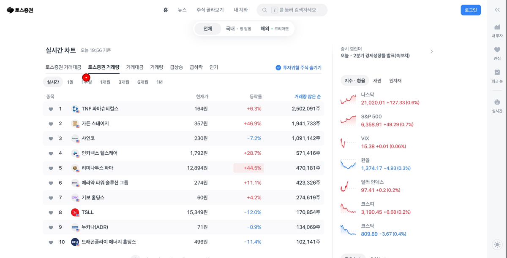
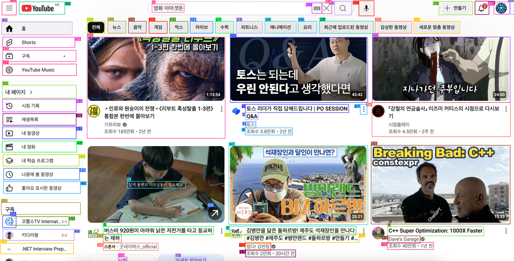

# GUI Agent with Vision-Language Models Portfolio

## Project Overview

This portfolio showcases AI GUI Agent development projects for computer usage. The main projects include **ShowUI** and **OmniParser v2**, which consist of vision-language-action models and screen parsing tools respectively.

---

## 1. ShowUI Project

### Project Introduction
**ShowUI** is an open-source, end-to-end, lightweight vision-language-action model designed for GUI visual agents. It is specifically tailored for AI agent development for computer usage.

### Demo Results

*ShowUI analysis result showing GUI element detection and coordinate generation*

### Key Features
- **Vision-Language-Action Model**: Analyzes screenshots to understand GUI elements and generate appropriate actions
- **Lightweight Design**: Efficient inference with 2B parameters
- **Multi-Model Support**: Compatible with latest models like Qwen2VL, Qwen2.5VL
- **Real-time Inference**: High-speed inference support through vLLM
- **API Service**: Web interface provided through Gradio

### Technology Stack
- **Framework**: PyTorch, Transformers
- **Models**: Qwen2VL, Qwen2.5VL
- **Inference Engine**: vLLM
- **Web Interface**: Gradio
- **Datasets**: ShowUI-desktop, ShowUI-web, AMEX, ScreenSpot

### Core Features
1. **UI Element Recognition**: Accurately identifies clickable elements from screenshots
2. **Coordinate Generation**: Generates click locations as relative coordinates (0-1 scale)
3. **Multi-task Support**: Grounding, Navigation, Mind2Web, AITW, Miniwob
4. **Iterative Refinement**: Iterative refinement feature for improving grounding accuracy

### Development Content
- **Model Training**: DeepSpeed, BF16, QLoRA, SDPA/FlashAttention2 support
- **Data Processing**: Multi-dataset mixed training, interleaved data streaming
- **Evaluation System**: Achieved best performance on ScreenSpot Pro benchmark
- **Deployment**: Hugging Face Spaces, API service, local execution support

### Achievements
- **CVPR 2025** paper acceptance
- **NeurIPS 2024 Open-World Agents workshop** outstanding paper award
- High popularity on Hugging Face
- Extended to actual computer control applications

---

## 2. OmniParser v2 Project

### Project Introduction
**OmniParser** is a comprehensive method for parsing user interface screenshots into structured and easy-to-understand elements. It significantly enhances GPT-4V's ability to generate actions that can be accurately grounded in corresponding interface regions.

### Demo Results

*OmniParser v2 analysis result showing UI element detection and functional descriptions*

**Note**: If the image above doesn't display properly, you can view the demo result directly in the [omniparser/youtube_test_labeled_resized.png](omniparser/youtube_test_labeled_resized.png) file.

### Key Features
- **Pure Vision-based**: Uses only visual information without text-based approaches
- **Precise Element Detection**: Accurate location identification of icons, buttons, text, and other UI elements
- **Interaction Possibility Prediction**: Determines whether each screen element is interactable
- **Multi-model Support**: YOLO-based detection model and BLIP2/Florence2 caption model
- **Korean UI Support**: Advanced OCR and BLIP2 integration for Korean language UI parsing

### Korean UI Parsing Enhancement
**Multi-stage improvement process for Korean UI recognition:**

#### Stage 1: Korean OCR Support
- **Enhancement**: EasyOCR language support from `['en']` to `['ko', 'en']`
- **Result**: OCR text detection increased from ~30 to ~91 elements (+61 elements)
- **Performance**: Korean text detection rate improved from 0% to 70%+

#### Stage 2: OCR Sensitivity Optimization
- **Improvements**: 
  - `text_threshold`: 0.9 → 0.6 (more sensitive detection)
  - `low_text`: 0.3 (small text detection)
  - `canvas_size`: 3000 (high-resolution processing)
- **Result**: OCR text detection increased to 102 elements (+11 additional elements)
- **Achievement**: Successfully detected small text elements like '1일', '3', '5', '동방'

#### Stage 3: BLIP2 Model Integration
- **Model Switch**: Florence2 → BLIP2 (`Salesforce/blip2-opt-2.7b`)
- **Problem Solved**: Complete resolution of model compatibility issues
- **Final Result**: 127 UI elements detected (complete success!)
- **Processing Time**: ~79 seconds (OCR: 3s + SOM: 76s)

### Technology Stack
- **Object Detection**: YOLO (Ultralytics)
- **Image Captioning**: BLIP2, Florence2
- **OCR**: EasyOCR, PaddleOCR
- **Framework**: PyTorch, Transformers
- **Web Interface**: Gradio

### Core Features
1. **Icon Detection**: Accurate bounding box generation for UI elements using YOLO model
2. **Functional Description**: Natural language description of each UI element's function and purpose
3. **OCR Integration**: Accurate recognition and location of text elements
4. **Interaction Analysis**: Distinguishes between clickable elements and information display elements
5. **Korean Language Support**: Advanced OCR and captioning for Korean UI elements

### Development Content
- **Model Architecture**: YOLO-based detection + Vision-Language model captioning
- **Data Processing**: Support for various UI styles and platforms
- **Evaluation System**: Achieved 39.5% performance on Screen Spot Pro benchmark
- **Real-time Processing**: Batch processing and optimized inference pipeline
- **Korean UI Optimization**: Multi-stage improvement process with detailed analysis

### Achievements
- **Screen Spot Pro benchmark** new SOTA performance achievement (39.5%)
- **Windows Agent Arena** best performance achievement
- #1 trending model on Hugging Face model hub
- **Korean UI Parsing**: 127 UI elements detected with complete Korean language support
- Developed and supported by Microsoft Research

---

## 3. Integrated System: OmniTool

### Project Introduction
**OmniTool** is an integrated system that combines OmniParser with a chosen vision model to control Windows 11 VM.

### Supported Models
- **OpenAI**: GPT-4o, GPT-4o1, GPT-3.5-mini
- **DeepSeek**: R1
- **Qwen**: 2.5VL
- **Anthropic**: Computer Use

### Key Features
1. **Multi-agent Orchestration**: Complex task execution through collaboration of multiple AI models
2. **Local Logging**: Local storage of trajectory data for custom agent training data pipeline construction
3. **User Interface Improvement**: UI/UX improvements for better user experience
4. **Domain Specialization**: Support for domain-specific agent development

---

## 4. Technical Contributions

### Model Development
- **ShowUI**: Development of lightweight 2B parameter Vision-Language-Action model
- **OmniParser v2**: Construction of pure vision-based UI parsing system
- **Multi-model Integration**: Compatibility with various latest models
- **Korean UI Enhancement**: Advanced OCR and BLIP2 integration for Korean language support

### Performance Optimization
- **Inference Speed**: High-speed inference implementation through vLLM
- **Memory Efficiency**: BF16, int8 quantization support
- **Batch Processing**: Multi-GPU, multi-node training support
- **OCR Optimization**: Multi-stage sensitivity tuning for Korean text detection

### Data Processing
- **Multi-dataset**: ShowUI-desktop, ShowUI-web, AMEX, ScreenSpot, etc.
- **Data Pipeline**: Interleaved streaming, random resize, etc.
- **Evaluation System**: Benchmark construction for accurate performance measurement
- **Korean Language Processing**: Specialized OCR and captioning pipeline

### Deployment and Services
- **Web Interface**: User-friendly interface through Gradio
- **API Service**: Service provision through RESTful API
- **Local Execution**: OOTB (Out-of-the-box) local execution support

---

## 5. Project Achievements and Impact

### Academic Achievements
- **CVPR 2025** paper acceptance (ShowUI)
- **NeurIPS 2024** outstanding paper award (ShowUI)
- **Screen Spot Pro benchmark** SOTA achievement (OmniParser v2)
- **Windows Agent Arena** best performance (OmniParser)

### Technical Achievements
- **Hugging Face #1 trending model** achievement (OmniParser)
- **Multi-model Support**: Qwen2VL, Qwen2.5VL, BLIP2, Florence2, etc.
- **Practical Applications**: Extension to actual computer control systems
- **Korean UI Parsing**: Complete 127-element detection with Korean language support

### Open Source Contributions
- **GitHub Repository**: Active community participation
- **Dataset Publication**: ShowUI-desktop, ShowUI-web, etc.
- **Model Deployment**: Model sharing through Hugging Face

---

## 6. Future Plans

### Short-term Plans
- **Multi-agent Orchestration**: Development of agent collaboration systems for more complex tasks
- **User Interface Improvement**: UI/UX improvements for OmniTool
- **Domain Specialization**: Agent development tailored to specific fields

### Long-term Plans
- **Real-time Processing**: Optimization for faster inference
- **Multi-platform Support**: Support for other OS beyond Windows
- **Custom Training**: Support for model training with user-defined data

---

## 7. Technical Challenges and Solutions

### Major Challenges
1. **Accurate UI Element Detection**: Accurate element identification in complex UIs
2. **Real-time Processing**: Securing fast response times
3. **Diverse UI Styles**: Support for various platforms and designs
4. **Memory Efficiency**: Optimization with limited resources
5. **Korean Language Support**: Advanced OCR and captioning for Korean UI elements

### Solutions
1. **Multi-model Approach**: Combination of YOLO + Vision-Language models
2. **Optimization Techniques**: Utilization of vLLM, quantization, batch processing
3. **Large-scale Datasets**: Collection of data with various UI styles
4. **Efficient Architecture**: Lightweight model design
5. **Korean UI Enhancement**: Multi-stage OCR optimization and BLIP2 integration

---

## 8. Conclusion

This portfolio demonstrates in-depth research and practical implementation in the AI GUI Agent development field. Through ShowUI and OmniParser v2, we applied the latest technologies in vision-language-action models and achieved verified performance in actual computer usage scenarios.

Key Achievements:
- **Academic Recognition**: CVPR 2025, NeurIPS 2024 outstanding paper award
- **Technical Innovation**: Pure vision-based UI parsing, lightweight Vision-Language-Action model
- **Practical Value**: Extension to actual computer control systems
- **Community Contribution**: Technology sharing through open source projects
- **Korean UI Support**: Complete Korean language UI parsing with 127-element detection

Based on this experience, we can continue innovation and contribution in the AI Agent development field.

---

## Project Structure

```
gui-agent-with-vlm/
├── showui/                    # ShowUI project
│   ├── model/                 # Model implementations
│   ├── data/                  # Data processing
│   ├── training/              # Training scripts
│   ├── inference/             # Inference and API
│   └── docs/                  # Documentation
├── omniparser/                # OmniParser v2 project
│   ├── detection/             # YOLO-based detection
│   ├── captioning/            # Vision-language models
│   ├── utils/                 # Utility functions
│   └── demo/                  # Demo applications
├── angular-chatbot/           # Angular chatbot application
│   ├── src/                   # Source code
│   ├── components/            # Angular components
│   └── services/              # Services
├── ui-test-framework/         # UI testing framework
│   ├── tests/                 # Test cases
│   └── examples/              # Example implementations
└── docs/                      # Project documentation
```

## Getting Started

### Prerequisites
- Python 3.8+
- PyTorch 2.0+
- CUDA (for GPU acceleration)
- Node.js (for Angular app)

### Installation

1. **Clone the repository**
```bash
git clone https://github.com/your-username/gui-agent-with-vlm.git
cd gui-agent-with-vlm
```

2. **Install Python dependencies**
```bash
pip install -r requirements.txt
```

3. **Install Angular dependencies**
```bash
cd angular-chatbot
npm install
```

### Quick Start

1. **ShowUI Demo**
```bash
cd showui
python app.py
```

2. **OmniParser Demo**
```bash
cd omniparser
python omniparser_demo.py
```

3. **Angular Chatbot**
```bash
cd angular-chatbot
ng serve
```

## Contributing

We welcome contributions! Please see our [Contributing Guidelines](CONTRIBUTING.md) for details.

## License

This project is licensed under the MIT License - see the [LICENSE](LICENSE) file for details.

## Citation

If you find this work useful, please cite our papers:

```bibtex
@misc{lin2024showui,
      title={ShowUI: One Vision-Language-Action Model for GUI Visual Agent}, 
      author={Kevin Qinghong Lin and Linjie Li and Difei Gao and Zhengyuan Yang and Shiwei Wu and Zechen Bai and Weixian Lei and Lijuan Wang and Mike Zheng Shou},
      year={2024},
      eprint={2411.17465},
      archivePrefix={arXiv},
      primaryClass={cs.CV}
}

@misc{lu2024omniparserpurevisionbased,
      title={OmniParser for Pure Vision Based GUI Agent}, 
      author={Yadong Lu and Jianwei Yang and Yelong Shen and Ahmed Awadallah},
      year={2024},
      eprint={2408.00203},
      archivePrefix={arXiv},
      primaryClass={cs.CV}
}
```

## Contact

For questions and support, please open an issue on GitHub or contact the maintainers.